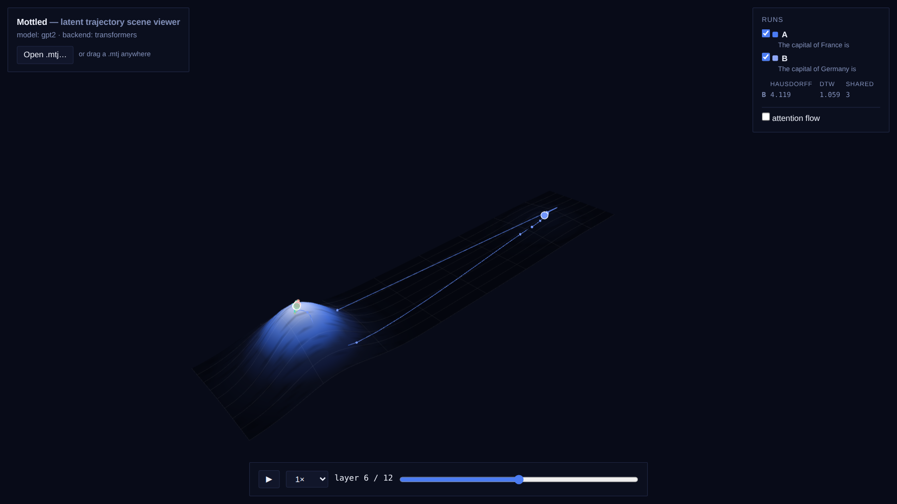
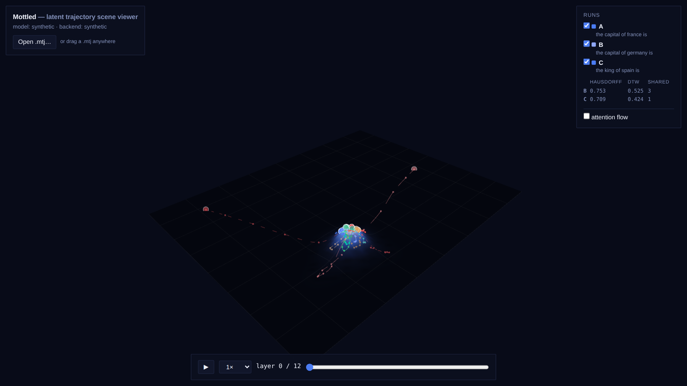

# 🔮 Mottled

[](https://github.com/BobGnarly420/mottled/actions/workflows/ci.yml)

**Interactive latent trajectory explorer for transformer forward passes.**

Mottled (formerly MARBLE) visualizes hidden-state evolution as
trajectories over a semantic manifold. It is *not* a neuron inspector,
feature-attribution tool, or explainability dashboard — it instruments
**latent dynamics**: how the
residual stream moves, turns, and settles as a prompt flows through the
layers of a transformer.

```
Prompt → forward pass → capture residual stream after every block
       → project hidden vectors → estimate local manifold
       → animate trajectory → expose semantic neighborhoods
```


*The Streamlit explorer with an A/B overlay — "The capital of France is" vs
"The capital of Germany is" — marbles at layer 12, inspector showing the
final token's predictions and semantic neighbors.*

**Live demo:** [bobgnarly420.github.io/mottled](https://bobgnarly420.github.io/mottled/) —
landing page plus the web viewer with bundled sample scenes (synthetic and
real GPT-2), no install required.

## Quickstart

```bash
pip install "mottled[models] @ git+https://github.com/BobGnarly420/mottled"
mottled                      # the Streamlit explorer
mottled serve --model gpt2   # web viewer + in-browser capture API
mottled export "The capital of France is" -o scene.mtj
```

(Or from a clone: `pip install -r requirements.txt && streamlit run ui.py`.)

Enter a prompt (e.g. `The capital of France is`), pick a model, press
**Run capture**. You get an animated hidden-state trajectory over a density
terrain, semantic neighbors, entropy evolution, and a layer scrubber.

The default `synthetic` backend needs no model download (or even torch) —
it generates deterministic, realistic trajectories so you can explore the
tool instantly. Select a HuggingFace model (Qwen / Llama / Mistral / Gemma /
GPT-2) for real captures.

### Self-portrait

`viewer/samples/self-portrait.mtj` is Mottled pointed at itself: GPT-2 —
the same class of machinery the tool was built to instrument — processing
Mottled's own self-descriptions ("Mottled visualizes hidden-state evolution
as trajectories over a semantic manifold"; "the residual stream moves,
turns, and settles"; "StateTrajectory is the center of the project"),
captured by Mottled and rendered by Mottled.
[View it live](https://bobgnarly420.github.io/mottled/viewer/?file=samples/self-portrait.mtj).
Given "the residual stream moves, turns, and settles", the model's top
continuation is " into" — it completes the thesis.

### A real model, not a sketch


*Real GPT-2: "The capital of France is" vs "The capital of Germany is"
(`viewer/samples/gpt2-capitals.mtj`). Both runs launch from the embedding
region and dive into the shared late-layer attractor basin; the logit-lens
readouts differ from layer 2, and attention patterns and the attn/MLP
residual decomposition are captured exactly (verified against HF's own
outputs in the test suite).*

## Programmatic API

```python
from capture import capture                # StateTrajectory
from projection import project             # (L, T, 2) coordinates
from density import compute_density        # Landscape
from terrain import mesh, drape            # TerrainMesh
from trajectory import extract, densify    # Trajectory list, animation path
from metrics import summarize              # research metrics
from compare import compare                # A/B trajectory comparison
from sae import demo_sae, feature_trajectory  # SAE feature activations
from sae import feature_field                 # SAE over the projection plane
from attractor import analyze, explain        # why the basin forms, in prose
from ui import run_pipeline, render        # everything at once → plotly Figure
from ui import run_scene, run_intervention  # multi-prompt scenes, patching

traj = capture("gpt2", "The capital of France is")
coords, projector = project(traj.hidden, method="pca")
landscape = compute_density(coords, method="kde")
surface = mesh(landscape)
paths = extract(coords, traj.tokens, mode="all_tokens")
print(summarize(traj, coords, token=-1))
```

`capture(model, prompt)` returns `hidden[layer][token][dimension]` wrapped in
a `StateTrajectory`, with logit-lens logits, entropy, and top-k predictions
attached per state.

## Architecture

**`StateTrajectory` (`trajectory.py`) is the center of the project — the
interchange format everything else plugs into.** Producers emit one, viewers
and analyses consume one, and neither side knows about the other:

```
producers                      interchange                     viewers
─────────                      ───────────                     ───────
transformers capture  ─┐                                 ┌─ Python / Streamlit (ui.py)
Mamba (state-space)   ─┼─►  StateTrajectory  ─► .mtj  ───┼─ web viewer (viewer/, WebGL)
synthetic generator   ─┘    (in memory)      (on disk)   ├─ Jupyter (render() is a
future: diffusion,                                       │  plain Plotly figure)
OpenAI / Anthropic                                       └─ future: desktop app
logprobs, neuro recordings
```

Python owns capture and analysis; `statefile.py` freezes both into the
versioned **`.mtj`** binary format ([spec](docs/mtj-format.md)) — a JSON
manifest plus raw little-endian buffers, parseable from any language with no
dependencies. Full-fidelity trajectory files round-trip a capture; compact
**scene** files carry finished analysis artifacts (projected + draped
trajectories, terrain, inspector stats) so a viewer only has to draw.

Transformers are one producer (`models/families.py` resolves
Qwen/Llama/Mistral/Gemma/GPT-2/NeoX layouts structurally); the synthetic
generator (`models/synthetic.py`) is another; **Mamba** — a state-space
model with no attention at all — is the proof the abstraction is not
transformer-shaped: its `backbone.layers` layout resolves structurally and
block capture + logit lens work unchanged (captures that don't apply, like
attention patterns, refuse loudly instead of lying). A new substrate —
diffusion, API logprobs (limited: no hidden states), biological recordings —
only needs to emit a `StateTrajectory` and the entire stack (projection,
density, terrain, metrics, comparison, every viewer) works unchanged.

| Module | Role |
|---|---|
| `capture.py` | Forward hooks on every block + logit lens → `StateTrajectory` |
| `projection.py` | PCA / UMAP plugin registry, incremental `transform`, per-state distortion (`projection_quality`) |
| `neighbors.py` | FAISS or NumPy cosine k-NN over hidden states & token embeddings |
| `density.py` | KDE / kNN-inverse-distance density → scalar potential field, with bootstrap standard-error field |
| `terrain.py` | Density → smoothed height map → mesh; drapes trajectories on it |
| `trajectory.py` | `StateTrajectory`, extraction modes (token / all / mean / CLS), spline densify |
| `metrics.py` | Entropy, KL, path length, curvature, velocity, drift, NN-stability |
| `attractor.py` | Why the basin forms and what it is made of: deceleration, membership, readout stability → measured prose (`explain`) |
| `cache.py` | Disk cache keyed by prompt + config hash |
| `config.py` | One dataclass for every pipeline knob |
| `ui.py` | Pure pipeline + pure Plotly renderer + Streamlit shell |
| `bvh.py` | Spatial index over trajectory segments (ray-pick / nearest / box / frustum) for the fly-through canvas |
| `intervene.py` | Causal interventions: perturb / set / noise / freeze a state via a resumable forward pass → counterfactual trajectory |
| `compare.py` | Trajectory comparison: Hausdorff, dynamic time warping, shared-prefix alignment, layerwise divergence profiles |
| `sae.py` | Sparse-autoencoder features: apply (never train) an SAE to every captured state; demo dictionary + npz interchange |
| `statefile.py` | `.mtj` interchange: save/load full StateTrajectories and viewer-ready scene bundles ([format spec](docs/mtj-format.md)) |
| `viewer/` | Self-contained WebGL viewer for `.mtj` scenes — no build step, no dependencies |
| `serve.py` | Optional stdlib capture backend: serves the viewer + a JSON API so the browser can generate scenes |
| `cli.py` | `mottled` console commands: explorer (default), `serve`, `export` |
| `site/` | Static landing page (deployed with the viewer to GitHub Pages) |

### Causal intervention (perturb-and-replay)

Observation shows what a system *did*; intervention shows what it *would have
done*. `intervene.py` runs a **resumable forward pass**: write-hooks rewrite
the residual stream at a chosen layer and the model continues from the edited
state, producing a **counterfactual `StateTrajectory`** — real data that flows
through the same projection / measurement / renderer stack as the baseline.

```python
from capture import capture
from intervene import Perturb, intervene, divergence

base = capture(model, "The capital of France is", tokenizer=tok)
# push the final state toward the " Berlin" embedding direction
d = base.embedding_matrix[berlin_id]
branch = intervene(model, "The capital of France is",
                   [Perturb(layer=base.n_layers - 1, delta=60 * d, token=-1)],
                   tokenizer=tok)
# baseline predicts " the"; the branch now predicts " Berlin" (p≈1.0)
print(divergence(base, branch).readout_changed)   # layer where the prediction flips
```

Edits: `Perturb` (push a state — the grab gesture), `SetState`, `InjectNoise`
(seeded), `FreezeLayer` (skip a block's update). Multiple interventions compose
in one pass. `divergence(baseline, branch)` measures where a branch separates
(state-space profile + the layer the top-1 prediction flips) — a measurement,
not a claimed cause. Interventions require a torch model; the synthetic backend
is analytic and not resumable.

### Trajectory comparison (prompt A/B)

Two forward passes become comparable once their states live in **one shared
projection** (`projection.project_joint` fits on the union of both runs).
`compare.py` then measures how the trajectories relate: symmetric **Hausdorff**
distance (how far apart the paths get), **dynamic time warping** (aligns paths
that trace the same route at different speeds), **shared-prefix** alignment,
and layerwise divergence profiles in full hidden space — including the first
token position where the runs separate and the first layer where the
logit-lens top-1 prediction differs.

```python
from capture import capture
from projection import project_joint
from compare import compare

a = capture("gpt2", "The capital of France is", tokenizer=tok)
b = capture("gpt2", "The capital of Germany is", tokenizer=tok)
(ca, cb), _ = project_joint([a.hidden, b.hidden])
cmp = compare(a, b, ca, cb)                  # geometry in the shared space
print(cmp.shared_tokens, cmp.hausdorff, cmp.dtw.normalized, cmp.readout_changed)
```

In the UI, fill in **Prompt B** and run: both trajectories are drawn on a
single terrain built from the union of states (B dashed), with the comparison
metrics and the per-layer A–B distance in the inspector.
`ui.run_compare(cfg, prompt_a, prompt_b)` is the programmatic entry point.
Everything is backend-agnostic — a synthetic run and the comparison stack work
without torch; the runs only need the same layer count and hidden dimension.

### SAE features & residual decomposition

`capture(model, prompt, capture_components=True)` additionally hooks every
block's attention and MLP submodules and records their outputs — the two
additive writes to the residual stream.  For pre-norm architectures
(Llama-style, GPT-2, NeoX) the decomposition is exact:
`hidden[l+1] = hidden[l] + attn[l] + mlp[l]` (pinned by tests).
`metrics.component_shares` turns it into a per-layer attention-vs-MLP
balance, and the UI plots it in the inspector.  The synthetic backend emits
an analogous exact decomposition, so the whole path works without torch.

`sae.py` applies sparse autoencoders to trajectories — it never trains them.
An SAE is four plain numpy arrays (`w_enc`, `b_enc`, `w_dec`, `b_dec`);
export any pretrained SAE (SAELens, dictionary-learning runs) to `.npz` and
`load_npz` it.  `demo_sae` builds an untrained random dictionary so the
feature pipeline — activations, top-features, UI overlay — runs offline
(demo activations are sparse projections, *not* interpretable features).

```python
from sae import load_npz, demo_sae, feature_trajectory, top_features

sae = demo_sae(traj.dim)          # or load_npz("gpt2-res-l8.npz")
acts = feature_trajectory(traj, sae)         # (L, T, F) activations
print(top_features(acts, layer=8, token=-1)) # strongest features at a state
```

In the UI, tick **SAE feature overlay**: trajectory markers are colored by
the selected feature's activation per layer, the inspector lists the top
features at the selected state, and a **Residual decomposition** panel shows
each block's attention/MLP share.

### Why the attractor: the explanatory layer

The terrain is a density field over the run's own projected states, so a
basin is a *pile-up*, not scenery — and `attractor.py` measures the
mechanism instead of leaving it implicit. `analyze(traj, coords, landscape)`
returns a `BasinReport`: the tracked token's own per-layer step (when it
decelerates and settles, versus when that token is simply passing through
someone else's basin), the membership roster across *every* token in the
run (which (layer, token) states sit above a density threshold — this is
a whole-run fact, not caused by the one tracked token), the layer from
which the logit-lens top-1 stops changing, entropy collapse, and the
attention/MLP share of the settled writes. `explain(report, traj)` turns
one report into prose in which every sentence is generated from a
measurement — nothing is canned lore, and it says so plainly when a token
*doesn't* settle rather than asserting deceleration that isn't there.

In the explorer this runs by default: the scene pins a callout to the
density peak (member count, layer range, settle layer, stabilized top-1),
and the **Why this attractor** inspector panel carries the full explanation
with the step and entropy profiles. "Attractor" stays descriptive geometry
— where this run's states accumulate — not a dynamical-systems claim.

```python
from attractor import analyze, explain

report = analyze(traj, coords, landscape)       # BasinReport
print(report.settle_layer, report.n_members, report.top_token)
print(explain(report, traj))                    # measured prose
```

### The SAE feature field: domain coloring for the latent manifold

The complex-plane plots that make f(z) visible — hue for arg(f), brightness
for |f|, rings at magnitude octaves — have a direct analogue here: the
projection plane is the domain, and the SAE dictionary is the function.
`sae.feature_field(sae, projector, grid_x, grid_y)` inverse-projects every
grid point back to hidden space (exact for PCA — the grid lands on the
fitted 2-plane, so the field shows what the SAE sees *along the plane you
are looking at*) and encodes it, recording the dominant feature and its
activation per point.

`ui.render_feature_field` renders it two ways: **plane** — flat domain
coloring (hue = dominant feature, the "phase"; brightness = activation, the
"modulus"; sawtooth rings at magnitude octaves) with the run's trajectory
drawn crossing feature domains — and **relief**, which lifts activation
into z and leaves holes where no feature fires. In the explorer, tick
**SAE feature field (domain coloring)**. As everywhere in `sae.py`, the
demo dictionary makes the machinery run offline; load real weights with
`sae.load_npz` for interpretable domains.

```python
from sae import demo_sae, feature_field
from ui import render_feature_field

sae = demo_sae(traj.dim)
land = result["landscape"]
field = feature_field(sae, result["projector"], land.grid_x, land.grid_y)
render_feature_field(field, sae, path=result["coords"][:, -1, :2]).show()
```

### Multi-prompt scenes, attention flow, interactive patching

`ui.run_scene(cfg, prompts)` generalizes the A/B overlay to N prompts: every
run is captured, joint-projected into one shared space, drawn on a single
terrain built from the union of all states, and compared against the first
run (in the UI, enter one overlay prompt per line — runs get A/B/C… labels
and distinct dash styles).

`capture(..., capture_attention=True)` records each block's head-averaged
attention pattern (`StateTrajectory.attention`, `(L-1, T, T)`; the eager
attention path is forced so the matrix actually materialises).  The renderer
can draw **attention flow** — edges from each token's state to the states it
reads from at the selected layer — and the inspector lists the top attended
tokens.  The synthetic backend generates a causal, deterministic analog.

`ui.run_intervention(cfg, prompt, edits, model, tokenizer)` is interactive
patching: the baseline and a perturb-and-replay branch (`intervene.py`)
are assembled as a two-run scene, with the full comparison plus an
`intervene.divergence` readout (separation onset, prediction-flip layer).
The UI exposes it as a sidebar panel — push a state toward a token
embedding, inject noise, or freeze a block, then watch the counterfactual
trajectory diverge on the same terrain.

### The `.mtj` interchange format & web viewer

```python
import statefile
from ui import run_scene

statefile.save(traj, "run.mtj")            # full-fidelity StateTrajectory
traj = statefile.load("run.mtj")           # round-trips every array

result = run_scene(cfg, [prompt_a, prompt_b])
statefile.save_scene(result, "scene.mtj")  # small, viewer-ready bundle
```

Scene files carry no hidden states — just draped trajectories, terrain and
inspector data — so they are small enough to hand to the browser. Open the
web viewer with any static file server:

```bash
python -m http.server            # from the repo root
# → http://localhost:8000/viewer/   (drag a .mtj in, or ?file=samples/scene-abc.mtj)
```


*The dependency-free WebGL viewer on `samples/scene-abc.mtj`: three runs on
one terrain, per-run visibility toggles, the comparison table, and the layer
scrubber.*

The Streamlit app has an **Export scene (.mtj)** button for whatever is
currently on screen. The viewer is plain WebGL2 with zero dependencies and
zero build step; producers in other languages only need to follow
[docs/mtj-format.md](docs/mtj-format.md).

**Capture from the browser**: `mottled serve --model gpt2` (or
`python serve.py`) runs a standard-library web server that hosts the viewer
*and* a capture API. The viewer discovers it at runtime and shows a prompt
form — type prompts, press Capture, and the scene is generated server-side
and streamed back as `.mtj`. On plain static hosting (GitHub Pages) the
form simply never appears.

### Interaction layer (in progress)

The exploratory canvas renders trajectories as curves (not voxels — projected
states occupy a vanishing fraction of any 3-D volume). `bvh.py` is the spatial
acceleration structure the interaction grammar needs: `ray_pick` powers the
"grab a state" gesture (camera ray → front-most segment within a pick radius),
`nearest` powers hover, `query_box` powers region select, and `query_frustum`
powers fly-through culling. It is backend-agnostic — it consumes projected 3-D
points (a projection output), never transformer internals — so any substrate
projected to ≤3-D is pickable. A volumetric (voxel-octree) renderer for
*fields* (density / flow) will land once we render ensembles rather than single
runs.

### Uncertainty: where the picture is trustworthy

Every step from hidden space to a 3-D scene loses information, and the tool
now measures the loss instead of hiding it. Two sources:

- **Projection distortion.** Flattening a `D`-dimensional residual stream to
  two coordinates cannot preserve every neighborhood.
  `projection.projection_quality(hidden, coords, projector)` reports, per
  state, the fraction of its hidden-space nearest neighbors that survive in
  the projection (`preservation`), and — for PCA — how far the state sits off
  the fitted plane (`residual`) and the global explained variance. A state
  with low preservation is drawn where the projection *could* put it, not
  where it truly is.
- **Density confidence.** The terrain is a KDE over one run's worth of
  points, so it is an estimate. `density.compute_density(..., bootstrap=B)`
  resamples the points `B` times and records the per-cell standard error
  (`Landscape.density_se`) in the same normalized units as the height — high
  SE marks relief that is bandwidth artifact rather than a real pile-up.

```python
from projection import project, projection_quality
from density import compute_density

coords, projector = project(traj.hidden, method="pca")
q = projection_quality(traj.hidden, coords, projector)
print(q.explained_variance, q.preservation.mean())   # global + per-state

land = compute_density(coords, bootstrap=32)
print(land.density_se.max())                          # confidence field
```

The explorer surfaces both in an **Uncertainty** inspector panel; the web
viewer adds an **uncertainty** terrain overlay (amber = high SE) and shows
per-state neighborhood fidelity on hover. Both quantities ride along in the
`.mtj` scene format (`terrain.se`, per-run `quality`), so any consumer can
render them.

### Design language

Every surface — the Plotly renderer, the Streamlit shell, the web viewer —
shares one design language (dark navy void `#080B18`, a single
precision-blue accent `#4B7CF3`, semantic data colors, 1px borders,
near-sharp corners, monospace for data values, no emoji in product UI).
The tokens live in three mirrored places: `ui.py` (`_MARBLE_COLORS`,
`_TERRAIN_COLORSCALE`), `.streamlit/config.toml`, and `viewer/style.css` —
change a value in all three to retheme.

The design language is also expected to *explain*, not just style: the
scene carries a measured callout at the density peak, captions state what
the terrain is made of, and the inspector's "Why this attractor" panel is
prose generated from this run's numbers (`attractor.explain`). The rule:
if the visualization invites a question ("why is that basin there?"), a
surface owes the measured answer.

### Plugin points

Projections (`projection.PROJECTIONS`), density estimators
(`density.DENSITY_ESTIMATORS`), neighbor backends (faiss/numpy), and metrics
(`metrics.METRICS`) are registries — register a class and it is available by
name, including in the UI dropdowns via `config.py`.

## Research metrics

Per-token trajectory summaries: path length, integrated curvature, average
semantic drift (cosine), layerwise displacement, entropy collapse, and
nearest-neighbor stability (Jaccard overlap of the token-embedding
neighborhood across layers).

## Tests

```bash
python -m pytest tests/ -q
```

Covers: hook captures match `output_hidden_states` exactly, logit lens
reproduces the model's final logits, shape consistency, projection
determinism, valid neighbor lookups, finite density (incl. degenerate
inputs), terrain mesh consistency and smoothing, animation continuity,
comparison geometry on analytic cases (Hausdorff, DTW alignment validity),
SAE encode/decode math and npz roundtrip, exact residual decomposition and
attention-pattern capture on locally-built Llama/GPT-2 models, multi-prompt
scene assembly, the intervention pipeline, and headless runs of the actual
Streamlit app — single-prompt, A/B, N-prompt scene, and SAE overlay —
(`streamlit.testing.v1.AppTest`).

## Non-goals (MVP)

No training or finetuning (SAEs are *applied*, never trained), no circuit
discovery, distributed inference, or production auth. Single-machine
research tool.

## Roadmap

- **Phase 2** — ✅ trajectory comparison: prompt A/B overlay, Hausdorff
  distance, dynamic time warping, shared-prefix divergence (`compare.py`,
  grown from the `metrics.branch_divergence` seed).
- **Phase 3** — ✅ SAE features (`sae.py`), residual decomposition
  (`capture_components`), feature overlays in the UI.
- **Phase 4** — ✅ multi-prompt scenes (`ui.run_scene`), attention flow
  (`capture_attention` + renderer edges), interactive patching
  (`ui.run_intervention` over `intervene.py`).
- **Interchange & viewers** — ✅ `StateTrajectory` as the interchange format:
  stable `.mtj` serialization (`statefile.py`, [spec](docs/mtj-format.md))
  and a dependency-free WebGL web viewer (`viewer/`).
- **Distribution** — ✅ pip-installable package with a `mottled` CLI, browser
  capture backend (`serve.py`), Mamba producer, real GPT-2 sample scene,
  GitHub Pages site (landing + viewer).
- **Explanatory layer** — ✅ attractor analysis (`attractor.py`): why the
  basin forms and what it is made of, as measured prose, pinned callouts,
  and inspector panels; SAE feature field (`sae.feature_field`) — domain
  coloring of the projection plane, plane and relief views.
- **Uncertainty** — ✅ projection distortion (`projection.projection_quality`:
  neighborhood preservation, reconstruction residual, explained variance) and
  a density confidence field (`density.compute_density(bootstrap=…)` →
  `Landscape.density_se`), surfaced in the explorer's Uncertainty panel and a
  web-viewer terrain overlay; both carried in the `.mtj` scene format.
- **Next** — desktop shell, volumetric field rendering for ensembles, SAE
  feature flows across layers, feature field in the web viewer, richer
  scene management (pin/hide runs, saved scenes), diffusion / recording
  producers.
