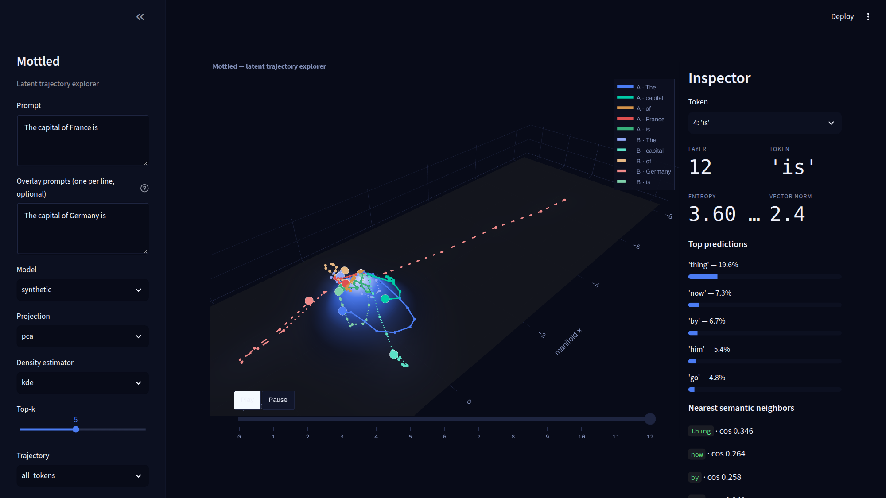

# 🔮 Mottled

[](https://github.com/BobGnarly420/mottled/actions/workflows/ci.yml)
[](LICENSE)

**A viewer for latent dynamics: where a model's hidden states travel, turn and
pile up as a prompt moves through the layers.**

Every 2-D picture of a residual stream is a lie of some size. Mottled's whole
pitch is that it *measures the size of the lie* and prints it on the picture —
per-state neighborhood preservation, a bootstrap confidence field on the
terrain, and an amber ✕ on every state whose local structure didn't survive the
flattening.



*"The capital of France is" vs "…of Germany is" on a shared density terrain.
Both runs launch from the embedding region and dive into the same late-layer
basin; the logit-lens readouts split at layer 2.*

## Try it without installing anything

**[bobgnarly420.github.io/mottled](https://bobgnarly420.github.io/mottled/)** —
WebGL viewer, real captures, no build step, no dependencies. Some scenes worth
opening:

| scene | what it shows |
|---|---|
| [`qwen-capitals`](https://bobgnarly420.github.io/mottled/viewer/?file=samples/qwen-capitals.mtj) | Qwen2.5-1.5B, 29 layers × 1536 |
| [`gpt2-decode`](https://bobgnarly420.github.io/mottled/viewer/?file=samples/gpt2-decode.mtj) | GPT-2 *generating* — the decode axis |
| [`models-qwen-gpt2`](https://bobgnarly420.github.io/mottled/viewer/?file=samples/models-qwen-gpt2.mtj) | two different models on one terrain |
| [`gpt2-features`](https://bobgnarly420.github.io/mottled/viewer/?file=samples/gpt2-features.mtj) | real SAE features, with their measured fit |
| [`self-portrait`](https://bobgnarly420.github.io/mottled/viewer/?file=samples/self-portrait.mtj) | Mottled pointed at itself (see below) |

Hover anywhere along a trajectory for the inspector; click to pin it.

## Install

```bash
pip install "mottled[models] @ git+https://github.com/BobGnarly420/mottled"

mottled                                    # Streamlit explorer
mottled serve --model gpt2                 # web viewer + in-browser capture
mottled export "The capital of France is" -o scene.mtj
mottled export "The residual stream" --generate 8 -o decode.mtj
mottled export "…" --models gpt2,distilgpt2 -o compare.mtj
```

The default `synthetic` backend needs no model download and no torch — it
generates deterministic, structurally realistic trajectories, so the whole
pipeline (and the test suite) runs offline in seconds.

## What it is — and what it isn't

This matters more than the feature list, so it goes near the top.

Mottled shows the **geometry of latent dynamics**. It is not a proof of
mechanism, and it tries hard not to let you mistake it for one:

- **A basin is states accumulating, not a circuit computing.** Attention flow
  and intervention divergence are measurements of what happened, not
  identified causes.
- **Projection fidelity is stated inline**, never buried in a collapsed panel.
  Low-preservation states are flagged on the scene itself.
- **An SAE is only interpretable on the distribution it was trained on.**
  Mottled measures the fit rather than trusting the filename — see below.
- **Feature names are leads, not labels.** They come from Neuronpedia's
  auto-interp explanations, written by a language model reading top
  activations. The UI names the model that wrote them and says they describe
  correlates, not computation.

For verified causal claims — circuit discovery, path patching, activation
patching at scale — use a dedicated tool
([TransformerLens](https://github.com/TransformerLensOrg/TransformerLens),
[circuit-tracer](https://pypi.org/project/circuit-tracer/), ACDC, EAP).
Mottled is the map you read *before* and *alongside* those, and it
interoperates: any `HookedTransformer` is a producer via
`models.hooked.from_hooked_transformer`.

## One finding worth stealing even if you never run this

Public GPT-2 SAEs are trained on **TransformerLens-processed** residuals. TL
folds LayerNorm and centres weights, which changes residual *values* while
preserving the model's function. So the same trained SAE reads:

- **~24%** reconstruction error on a TransformerLens capture
- **~342%** on raw HuggingFace hidden states

Same model, same SAE, same prompt. Provenance is not calibration. `fit_report`
measures reconstruction error and firing density per layer, and the UI labels
a bad fit as extrapolation instead of drawing confident features on top of it.
Pleasingly, the fit measurement rediscovers the SAE's training hook on its own
— best layer 8, exactly where it was trained.

```python
from sae import fetch_from_hub, fit_report
fit = fit_report(fetch_from_hub(), traj)   # → best_layer, recon_error, active_frac
```

## What you get

**Two time axes.** Layers within a forward pass, and *decode steps* within a
generation. `generate_and_capture` decodes then captures the finished sequence
in one pass — causal attention makes that exact, so it stays an ordinary
`StateTrajectory`.

**Cross-model comparison.** Models share no hidden space, so `crossmodel`
builds one from the only thing they do share — the vocabulary they read out
into — keeping the mass each spends outside it in a visible `⟨unshared⟩`
bucket. `layer_similarity` answers "which layer of B matches layer *l* of A"
with CKA, and reports whether its own answer is *identified* rather than
always returning an argmax. (On a raw residual stream CKA saturates: every
layer scores ~1.0 against every other. Z-scoring first recovers a monotone,
proportional alignment — GPT-2's 13 layers onto DistilGPT-2's 7.)

**Causal interventions.** Perturb / set / noise / freeze a state, replay the
forward pass from there, and score the result against a norm-matched random
control so a flipped prediction can be attributed to the direction rather than
the perturbation's size.

**SAE features**, applied and never trained — with the measured fit above, and
domain-colored feature fields that name their largest territories.

**Uncertainty everywhere.** Neighborhood preservation per state, explained
variance, and a bootstrap standard-error field over the density terrain.

## Programmatic API

```python
from capture import capture, generate_and_capture
from projection import project
from density import compute_density
from terrain import mesh
from ui import run_pipeline, render          # everything at once → plotly Figure

traj = capture("gpt2", "The capital of France is")
coords, projector = project(traj.hidden, method="pca")
fig = render(**run_pipeline(cfg, prompt))    # or drive the pieces yourself
```

`capture()` returns `hidden[layer][token][dim]` in a `StateTrajectory`, with
logit-lens logits, entropy and top-k attached per state. Everything downstream
is a pure function over that object — no torch, no transformer internals.

## Architecture

`StateTrajectory` is the only interchange. Producers emit one; analyses and
viewers consume one; neither knows about the other.

```
producers                    interchange                viewers
─────────                    ───────────                ───────
transformers (HF hooks) ─┐                        ┌─ Streamlit explorer
TransformerLens         ─┤                        ├─ WebGL viewer (no deps)
Mamba (state-space)     ─┼─► StateTrajectory ─► .mtj ─┤
API logprobs (degraded) ─┤                        └─ Jupyter (plain Plotly)
synthetic               ─┘
```

`.mtj` ([spec](docs/mtj-format.md)) is a JSON manifest plus little-endian
typed-array buffers — glTF-style. A JS reader needs `DataView`; a Python
reader needs `struct` and `numpy.frombuffer`. A cross-language conformance
test pins the Python writer against the JavaScript reader, and a second one
pins the spatial index the viewer picks with against its Python reference.

**Closed models are a producer too**, honestly bounded. `models/logprobs.py`
turns API top-k logprobs into a *degraded* trajectory: no residual stream
exists, so depth is unavailable, the animated axis becomes decode time, and
the geometry is the model's output distribution. It declares what it cannot
see (`meta.absent`) and that its entropy is a lower bound, and the explorer
prints that as a banner.

## Models

Verified end to end, with the attn/MLP residual decomposition reconciling
**exactly** (`max |h[l+1] − (h[l] + attn + mlp)| = 0.0000`):
Qwen2.5-1.5B-Instruct (GQA/RoPE/SwiGLU/RMSNorm), GPT-2, DistilGPT-2,
Pythia-70m, synthetic. Llama-3.2 and Gemma-2 work identically but are
licence-gated on the Hub, so they can't back bundled samples or offline CI.

**Mamba** is the proof the abstraction isn't transformer-shaped: its layout
resolves structurally, block capture and the logit lens work unchanged, and
the captures that don't apply to a state-space model — attention patterns, the
attn/MLP split — *refuse loudly rather than returning something plausible.*

Asked for the capital of France, Qwen answers `" Paris"`; GPT-2 says `" the"`.
[`models-qwen-gpt2.mtj`](viewer/samples/models-qwen-gpt2.mtj) puts both on one
terrain across a 29×1536 vs 13×768 divide.

### Self-portrait

[`self-portrait.mtj`](https://bobgnarly420.github.io/mottled/viewer/?file=samples/self-portrait.mtj)
is Mottled pointed at itself: GPT-2 processing three of Mottled's own
self-descriptions — *"Mottled visualizes hidden-state evolution as
trajectories over a semantic manifold"*, *"the residual stream moves, turns,
and settles"*, *"StateTrajectory is the center of the project"* — captured and
rendered by Mottled. Given the second one, GPT-2's top continuation is
`" into"`. It finishes the thesis.

## Docs

- [`docs/mtj-format.md`](docs/mtj-format.md) — the `.mtj` interchange spec
- [`docs/field-notes.md`](docs/field-notes.md) — dated orientation to the
  interpretability landscape: the tool stack, which public SAE suites exist,
  what's contested, and the traps this project has already paid for
- [`ROADMAP.md`](ROADMAP.md) · [`CHANGELOG.md`](CHANGELOG.md)

## Tests

```bash
pytest -m "not network"     # 291 offline
node --test viewer/tests/   # 51, no npm install
```

The offline suite includes torch mechanism tests on locally-built models —
hook captures pinned against HF's own `hidden_states`, the residual
decomposition against the real attention and MLP outputs. `-m network`
adds tests that hit the Hub and Neuronpedia.

## Non-goals

No training or finetuning (SAEs are applied, never trained). No circuit
discovery, no distributed inference, no production auth. Single-machine
research tool.

## License

[Apache 2.0](LICENSE) — permissive with an explicit patent grant, matching the
ecosystem it interoperates with (TransformerLens, SAELens, nnsight). See
[`NOTICE`](NOTICE).
